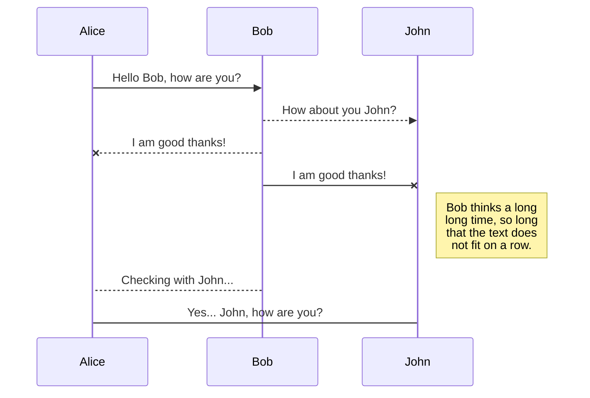
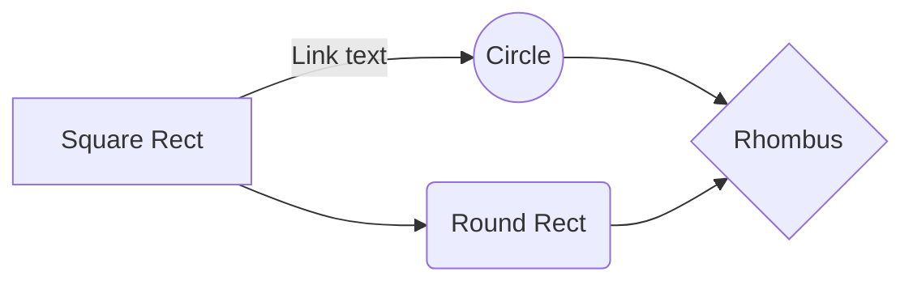

# h1 Heading
## h2 Heading
### h3 Heading
#### h4 Heading
##### h5 Heading
###### h6 Heading

# Horizontal Rules

___

---

***

## Typographic replacements

Enable typographer option to see result.

(c) (C) (r) (R) (tm) (TM) (p) (P) +- 

test.. test... test..... test?..... test!....

!!!!!! ???? ,,  -- ---

"Smartypants, double quotes" and 'single quotes'


## Emphasis

**This is bold text**

__This is bold text__

*This is italic text*

_This is italic text_

~~Strikethrough~~


## Blockquotes


> Blockquotes can also be nested...
>> ...by using additional greater-than signs right next to each other...
> > > ...or with spaces between arrows.


## Lists

Unordered

+ Create a list by starting a line with `+`, `-`, or `*`
+ Sub-lists are made by indenting 2 spaces:
  - Marker character change forces new list start:
    * Ac tristique libero volutpat at
    + Facilisis in pretium nisl aliquet
    - Nulla volutpat aliquam velit
+ Very easy!

Ordered

1. Lorem ipsum dolor sit amet
2. Consectetur adipiscing elit
3. Integer molestie lorem at massa

Start numbering with offset:

65. foo
66. bar

In addition, You can avoid a number as a list item by escaping character:

1949\.  The People's Republic of China was founded.


## Code

Inline `code`

Indented code

    // Some comments
    line 1 of code
    line 2 of code
    line 3 of code


Block code "fences"

```
Sample text here...
```

Syntax highlighting

``` js
var foo = function (bar) {
  return bar++;
};

console.log(foo(5));
```

## Links

[link text](http://dev.nodeca.com)

[link with title](http://nodeca.github.io/pica/demo/ "title text!")

Autoconverted link https://github.com/nodeca/pica (enable linkify to see)L

Links have a footnote style syntax: [link text][1]

[1]: http://dev.nodeca.com

## Images


Like links, Images also have a footnote style syntax

![Alt text][id]

With a reference later in the document defining the URL location

[id]: http://image.banshujiang.cn/66s.jpeg

Of cause you can write HTML directly to achieve the effect you want:
<div>


</div>

## Plugins

### Emojies

:wink: :cry: :laughing: :yum: :smile: :grin: :blush: :sob: :+1: :-1: :punch: :v: :kiss: :ear: ...

### Subscript/ Superscript

- 19^th^

You can also write `$19^{th}$` : $19^{th}$

- H~2~O

You can also write `$H_2O` : $H_2O$

### Footnotes

Footnote 1 link[^first].

Footnote 2 link[^second].

Inline footnote^[Text of inline footnote] definition.

Duplicated footnote reference[^second].

[^first]: Footnote **can have markup**

    and multiple paragraphs.

[^second]: Footnote text.


### Definition lists

Term 1

:   Definition 1
with lazy continuation.

Term 2 with *inline markup*

:   Definition 2

        { some code, part of Definition 2 }

    Third paragraph of definition 2.

_Compact style:_

Term 1
  ~ Definition 1

Term 2
  ~ Definition 2a
  ~ Definition 2b


### SmartyPants

SmartyPants converts ASCII punctuation characters into "smart" typographic punctuation HTML entities. For example:

| Left-Aligned  | Center Aligned  | Right Aligned |
| :------------ |:---------------:| -----:|
| col 3 is      | some wordy text | $1600 |
| col 2 is      | centered        |   $12 |

You can also omit the vetical marks on both ends:

First Header | Second Header
------------ | -------------
Content from cell 1 | Content from cell 2
Content in the first column | Content in the second column


### KaTeX

You can render LaTeX mathematical expressions using [KaTeX](https://khan.github.io/KaTeX/):

The *Gamma function* satisfying $\Gamma(n) = (n-1)!\quad\forall n\in\mathbb N$ is via the Euler integral

$$
\Gamma(z) = \int_0^\infty t^{z-1}e^{-t}dt\,.
$$

$$
\oint_C x^3dx + 4y^2dy
$$

$$
2 = \left(
 \frac{\left(3-x\right) \times 2}{3-x}
 \right)
\sum_{m=1}^\infty\sum_{n=1}^\infty\frac{m^2\,n}
 {3^m\left(m\,3^n+n\,3^m\right)}
$$

$$
\phi_n(\kappa) =
 \frac{1}{4\pi^2\kappa^2} \int_0^\infty
 \frac{\sin(\kappa R)}{\kappa R}
 \frac{\partial}{\partial R}
 \left[R^2\frac{\partial D_n(R)}{\partial R}\right]\,dR
$$

> You can find more information about **LaTeX** mathematical expressions [here](http://meta.math.stackexchange.com/questions/5020/mathjax-basic-tutorial-and-quick-reference).


### UML diagrams

You can render UML diagrams using [Mermaid](https://mermaidjs.github.io/). For example, this will produce a sequence diagram:



And this will produce a flow chart:




<!--stackedit_data:
eyJoaXN0b3J5IjpbMTYzNzYxNzk0M119
-->